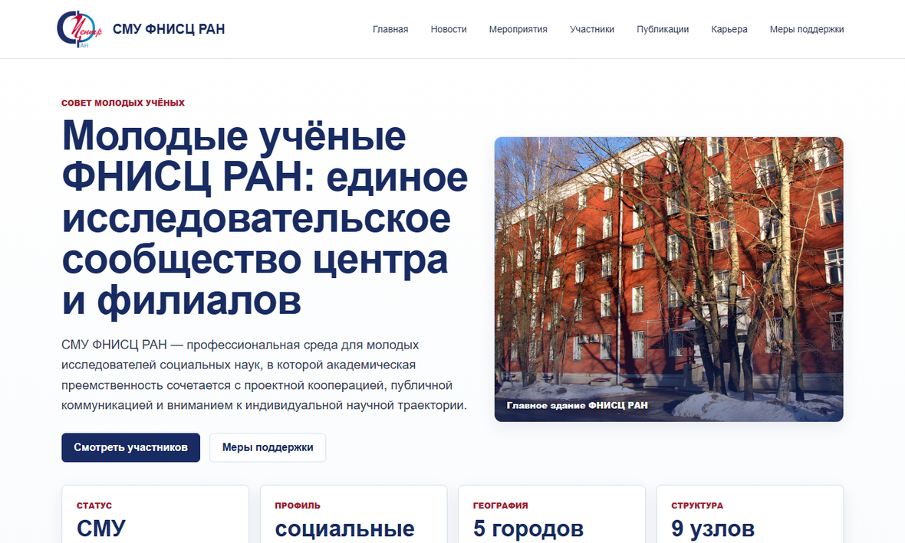
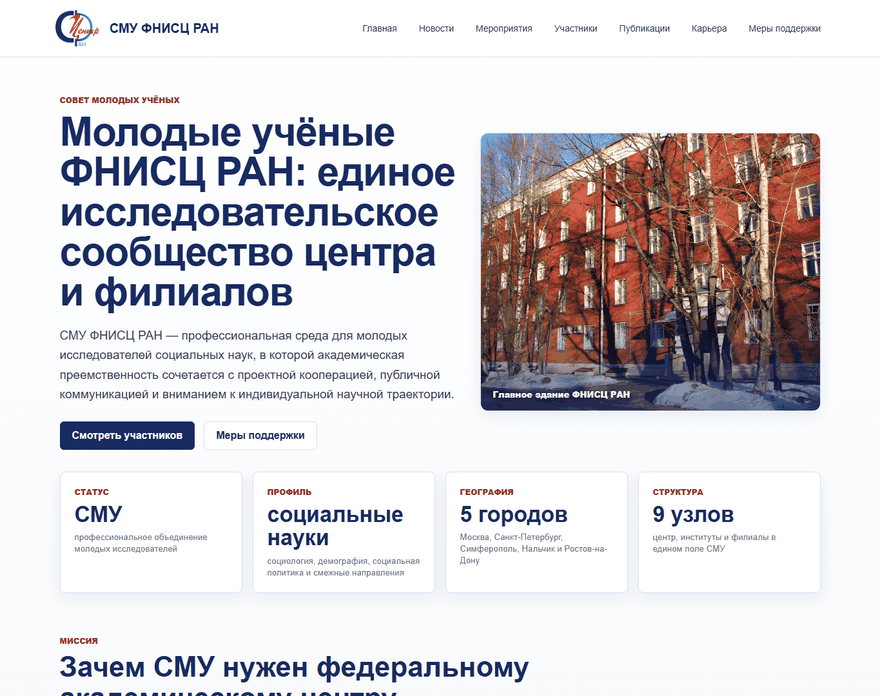
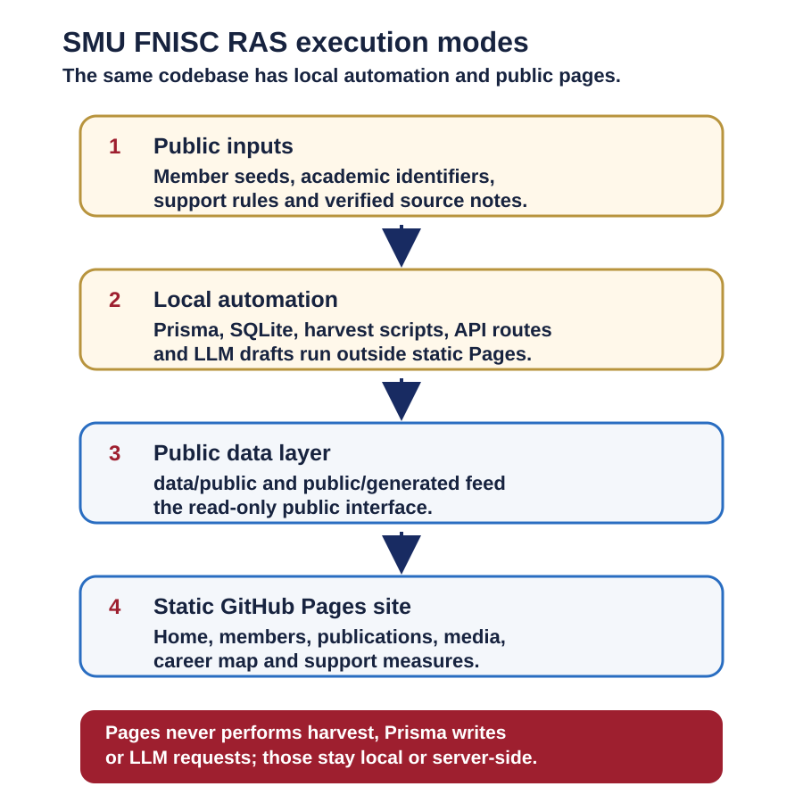
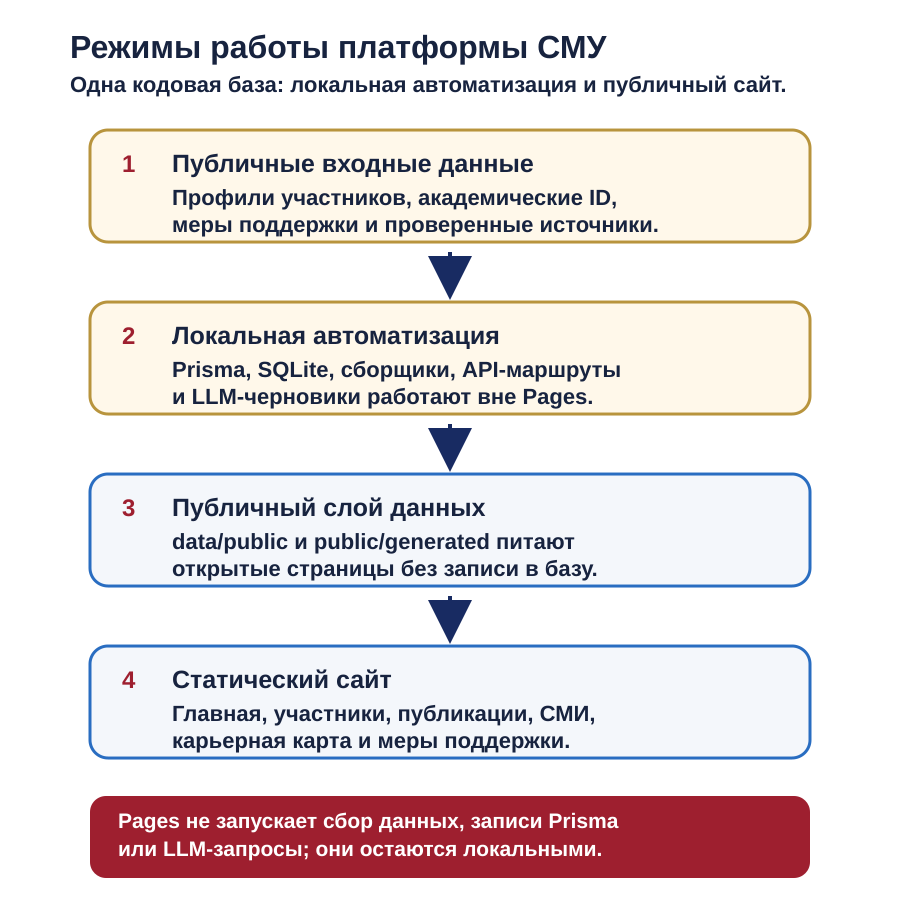

# SMU FNISC RAS platform

[English](#english) | [Русский](#русский)


*Public Russian homepage from the GitHub Pages build.*

<a id="english"></a>
## English

**Live site:** [arseniy24rus.github.io/SMU-FNISC-platform](https://arseniy24rus.github.io/SMU-FNISC-platform/)

### Capabilities And Scenario

This repository is a Next.js and TypeScript platform for the Young Scientists Council of the Federal Center of Theoretical and Applied Sociology of the Russian Academy of Sciences. It is written as a managed IT platform, not a landing page: the public surface explains the Council, lists members, shows publications, media mentions, career navigation and support measures, while the local/server surface contains harvest, Prisma, API and LLM-assisted draft workflows. The intended audience is a council coordinator or young researcher who needs one place to see the public registry, publication evidence, support opportunities and next academic-career steps.

The public UI is Russian only. The visual assets in this README show the real Russian GitHub Pages export. In the current public data layer the site includes 23 member profiles, 157 canonical publication records, 65 media mentions, 23 career maps and 8 support-measure entries. A realistic scenario is simple: open the public homepage, filter the member directory by institute or research interest, filter publications by source and year, and then open the career map for a selected member. The career page translates legal and profile data into milestones and next actions; it is a navigation aid, not a legal conclusion. That distinction is documented in [docs/CAREER_RULES.md](docs/CAREER_RULES.md).


*Demo: member filtering, publication filtering and the career map in the published Russian interface.*

### Data And Methodology

The important architectural boundary is between public static export and local automation. GitHub Pages serves the `out/` artifact created by `pnpm build:pages`; in that mode the public pages read JSON from [data/public](data/public) and [public/generated](public/generated), and they do not execute Node.js API routes, Prisma queries, LLM calls or harvest jobs. Local development can use Prisma with SQLite, seed scripts, profile-photo fetches, publication/media harvesters and protected API routes. [docs/DEPLOYMENT.md](docs/DEPLOYMENT.md) explicitly separates the static Pages build from the recommended production Node/PostgreSQL/S3/worker architecture.


*The public site is a read-only static export; data collection and administrative work stay in local or server mode.*

### Architecture

Data contracts are intentionally conservative. [docs/DATA_CONTRACTS.md](docs/DATA_CONTRACTS.md) says public member records contain academic fields such as name, institute, position, degree status, interests, public academic email and identifiers; phones and private notes stay out of the public seed. Harvest raw/cache/report output belongs in local folders such as `data/local/harvest/<timestamp>/raw/*`, while stable public JSON feeds the site. [docs/HARVEST_LOCAL.md](docs/HARVEST_LOCAL.md) records source behavior for eLibrary, Scopus, WoS, OpenAlex and media RSS, including fallback when a source requires keys, cookies or manual cache.

### Limitations

Limitations are part of the product. There is no production authentication, role model, private profile claiming or persistent moderation interface yet; [docs/CODEX_TASKS.md](docs/CODEX_TASKS.md) lists those future phases. GitHub Pages cannot run `/api/*`, Prisma, LLM press-release generation or nightly harvest. The support page has a visible verification date in the app and should be reviewed before real applications. Public logos and building images are local assets, but [public/brand/README.md](public/brand/README.md) notes that FNISC logo usage should be checked with the rights holder before production publication.

### Local Use

<details>
<summary>Run and check commands</summary>

Quick local start on Windows:

```text
ПУСК_СМУ_ФНИСЦ_РАН.cmd
```

Manual local mode:

```bash
pnpm install
pnpm prisma:generate
pnpm prisma:migrate
pnpm seed
pnpm harvest:all:local
pnpm dev
```

Static Pages build:

```bash
pnpm build:pages
```

Checks:

```bash
pnpm lint
pnpm typecheck
pnpm test
pnpm audit:public-data
pnpm build
```

</details>

No top-level project license file is present. Reuse of code, data, texts, photographs and official identity assets should therefore be treated as rights-reserved unless a specific upstream license or permission is documented in the relevant file or source note.

<a id="русский"></a>
## Русский

**Живая версия:** [arseniy24rus.github.io/SMU-FNISC-platform](https://arseniy24rus.github.io/SMU-FNISC-platform/)

### Возможности и сценарий

Этот репозиторий содержит платформу Совета молодых учёных ФНИСЦ РАН на Next.js и TypeScript. Проект задуман как управляемая информационная система, а не как лендинг: опубликованная часть показывает Совет, участников, публикации, СМИ, карьерную навигацию и меры поддержки, а локальный или серверный контур отвечает за сбор данных, Prisma, служебные маршруты и подготовку черновиков с помощью языковых моделей. Основной пользователь - координатор СМУ или молодой исследователь, которому нужен единый рабочий слой для публичного реестра, публикационной видимости, карьерных шагов и справочника поддержки.

Публичный интерфейс только на русском языке. Текущий открытый слой данных, проверенный по JSON-файлам в [data/public](data/public), содержит 23 профиля участников, 157 канонических публикаций, 65 медиаупоминаний, 23 карьерные карты и 8 записей о мерах поддержки. Типичный сценарий: открыть главную страницу, отфильтровать состав СМУ по институту или научным интересам, отфильтровать публикации по источнику и году, затем открыть карьерную карту конкретного участника. Карьерный экран переводит нормативные условия и данные профиля в крупные этапы и следующие действия, но не является юридическим заключением; это зафиксировано в [docs/CAREER_RULES.md](docs/CAREER_RULES.md).


*Демо: фильтрация участников, фильтрация публикаций и карьерная карта в опубликованном русском интерфейсе.*

### Данные и методика

Главная архитектурная граница проходит между опубликованной статической сборкой и локальной автоматизацией. GitHub Pages отдаёт каталог `out/`, который создаётся командой `pnpm build:pages`; в этом режиме публичные страницы читают JSON из [data/public](data/public) и [public/generated](public/generated), но не выполняют служебные маршруты Node.js, запросы Prisma, обращения к языковым моделям или задачи сбора данных. Локальная разработка может использовать Prisma + SQLite, скрипты наполнения базы, загрузку фотографий, сбор публикаций и СМИ, а также защищённые служебные маршруты. [docs/DEPLOYMENT.md](docs/DEPLOYMENT.md) отдельно описывает статическую сборку для Pages и рекомендуемую промышленную схему с Node.js, PostgreSQL, S3/MinIO и отдельным фоновым процессом.


*Схема: опубликованный сайт читает подготовленные открытые данные; сбор данных и администрирование выполняются отдельно.*

### Архитектура

Контракты данных нарочно осторожны. [docs/DATA_CONTRACTS.md](docs/DATA_CONTRACTS.md) определяет публичный профиль участника как набор академических полей: ФИО, институт, должность, степень или статус, интересы, публичный академический e-mail и идентификаторы. Телефоны и служебные комментарии не попадают в публичную исходную таблицу. Исходные выгрузки, кэш и отчёты сборщиков должны оставаться в локальных папках вроде `data/local/harvest/<timestamp>/raw/*`, а сайт читает устойчивый слой `data/public`. [docs/HARVEST_LOCAL.md](docs/HARVEST_LOCAL.md) описывает eLibrary, Scopus, WoS, OpenAlex и медиа-RSS, включая корректное поведение при отсутствии ключей, файлов cookie или доступного кэша.

### Ограничения

Ограничения важны. В текущей версии ещё нет промышленной авторизации, полноценной ролевой модели, закрытого подтверждения профиля участника и постоянного интерфейса модерации; будущие этапы перечислены в [docs/CODEX_TASKS.md](docs/CODEX_TASKS.md). GitHub Pages не запускает `/api/*`, Prisma, генерацию пресс-релизов с помощью языковой модели и ночной сбор данных. Страница мер поддержки имеет видимую дату проверки в приложении и требует актуализации перед реальной подачей заявок. Логотипы и изображения лежат локально, но [public/brand/README.md](public/brand/README.md) отдельно просит сверить правила использования официального логотипа ФНИСЦ РАН с правообладателем перед публичным промышленным размещением.

### Локальный запуск

<details>
<summary>Команды запуска и проверки</summary>

Быстрый локальный запуск на Windows:

```text
ПУСК_СМУ_ФНИСЦ_РАН.cmd
```

Ручной локальный режим:

```bash
pnpm install
pnpm prisma:generate
pnpm prisma:migrate
pnpm seed
pnpm harvest:all:local
pnpm dev
```

Статическая сборка для Pages:

```bash
pnpm build:pages
```

Проверки:

```bash
pnpm lint
pnpm typecheck
pnpm test
pnpm audit:public-data
pnpm build
```

</details>

В репозитории нет корневого файла лицензии проекта. Поэтому повторное использование кода, данных, текстов, фотографий и официальной айдентики следует считать ограниченным правами правообладателей, если конкретная лицензия или разрешение не указаны в соответствующем файле или примечании к источнику.
